 # 🏠 House Rent System - Full Stack Web Application

Welcome to House Rent System, a modern, responsive, and fully functional web application built using *React (Frontend), Node.js, Express, and MongoDB (Backend)*. This platform allows landlords to list properties and tenants to browse, search, and book rental houses efficiently.

---

## 🖼 Preview

### 🏡 Homepage
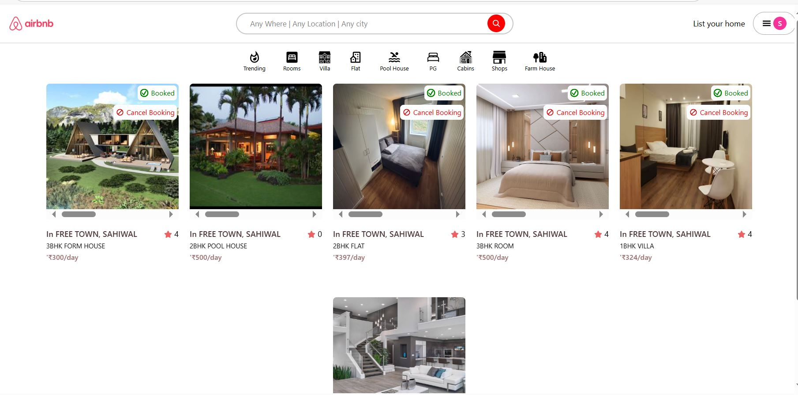

### 🏡 Homepage
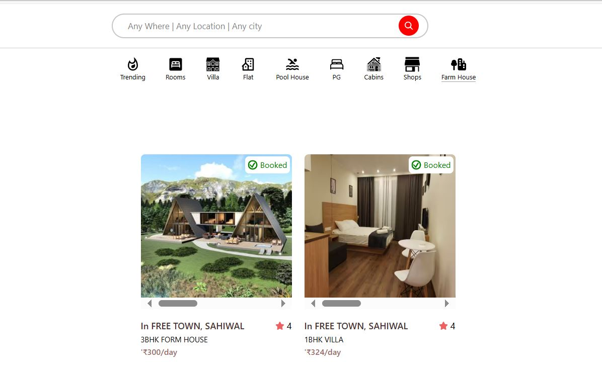

### 🏡 Booked House
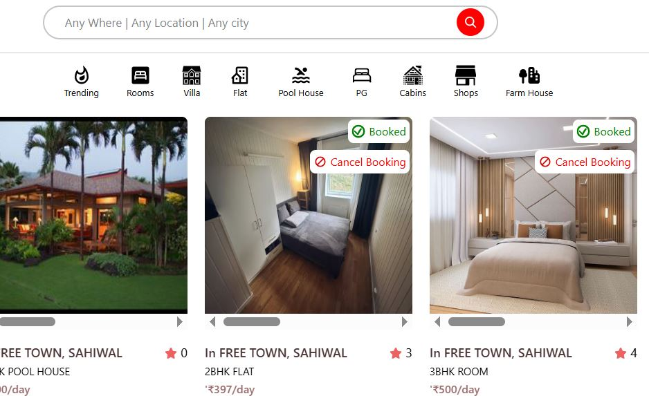

### 📜 My Listings 
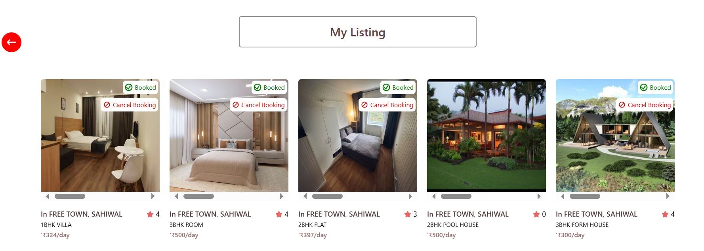

### 🔎 Search House 
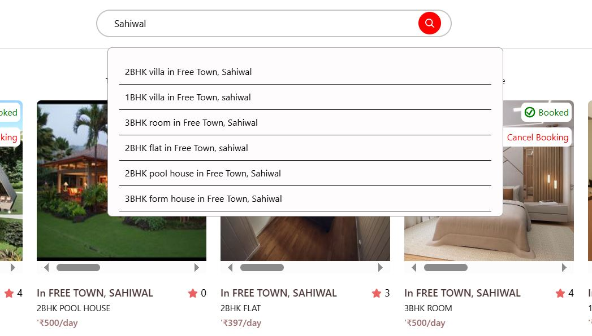

### ⭐ Rating
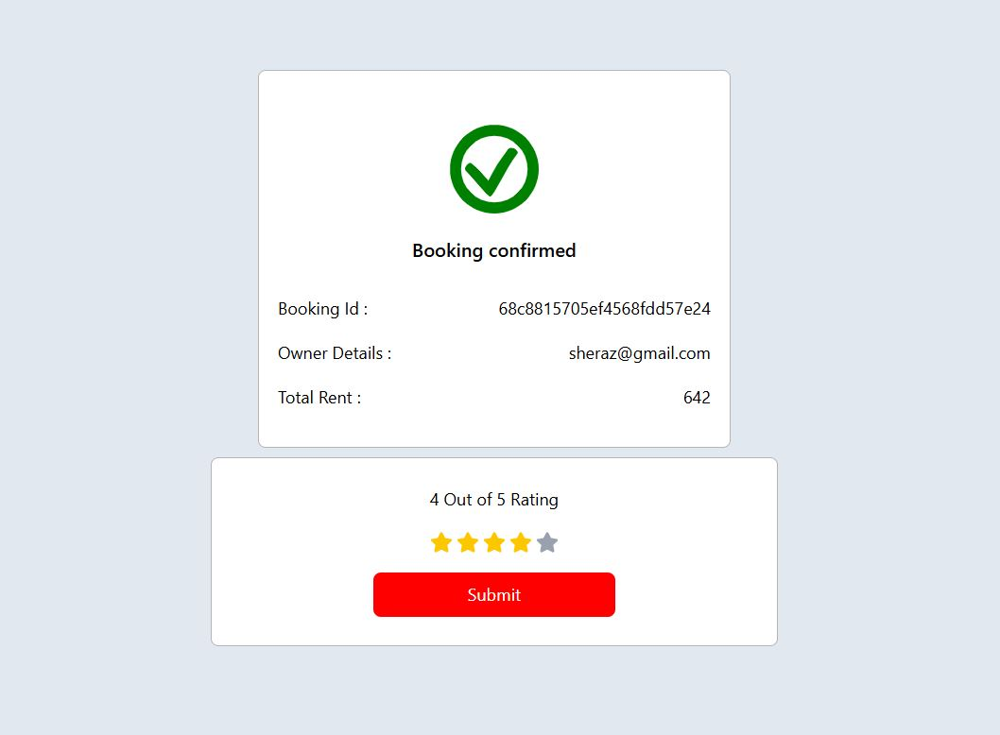

### ➕ Add Listing
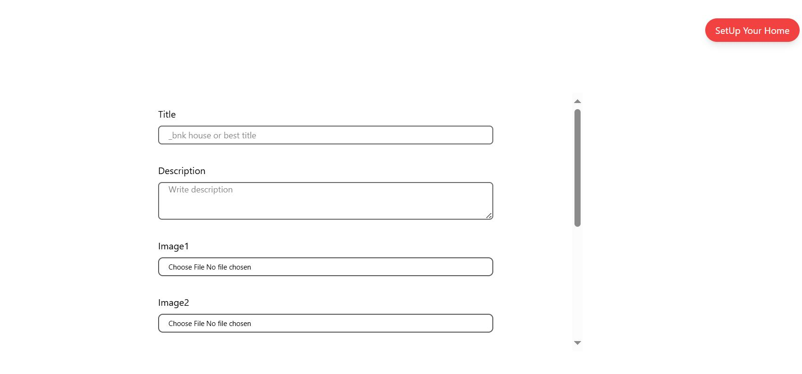

### 📝 Update Listing
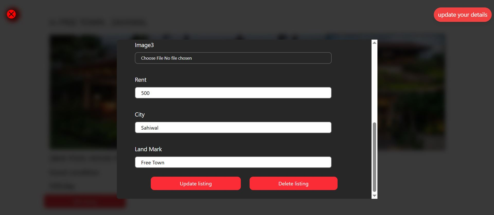

### 👥 Signup Page
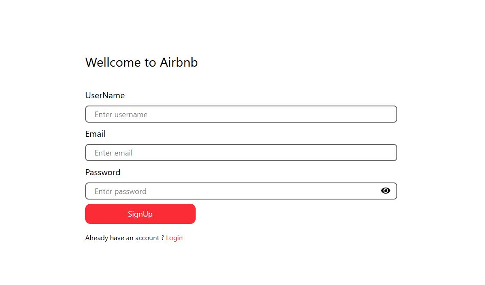

### 🔑 Login Page
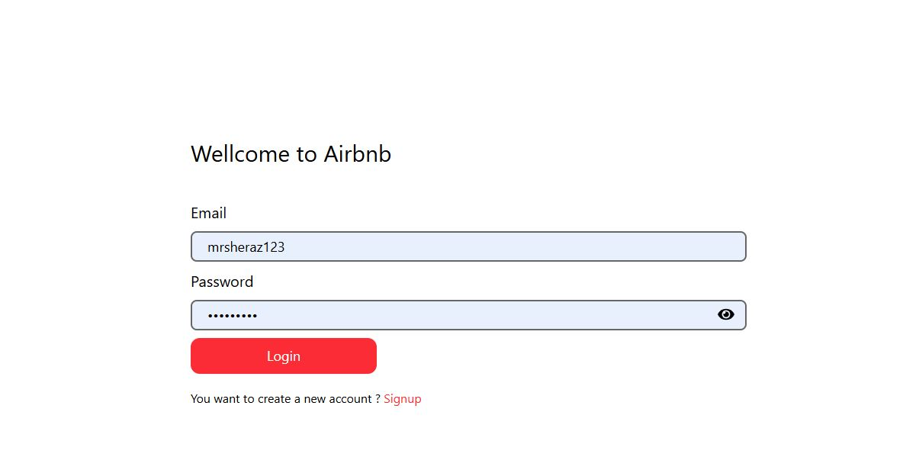

### 🏨 Booking Now
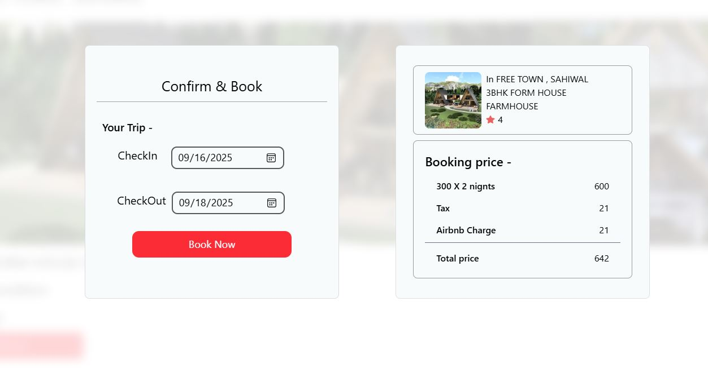

---

## 🚀 Features

- 📱 Fully responsive layout (mobile-first design)  
- 🏘 Browse available houses with images, details, and pricing  
- 🔎 Filter houses by location, type, and rent range  
- 📝 Booking form for tenants with email confirmation  
- 🔑 Admin panel for adding, updating, and deleting listings  
- 🕑 Manage availability and rental status  
- 📧 Contact form for inquiries  
- ⚛ *React Frontend* for smooth UI updates and state management  

---

## 🛠 Built With

- ✅ *Frontend*: React.js, HTML5, CSS3 (Flexbox/Grid, Animations), JavaScript (DOM, Events)  
- ✅ *Backend*: Node.js, Express.js  
- ✅ *Database*: MongoDB (NoSQL)  
- ✅ *Authentication*: JWT / Session-based login  
- ✅ *Email Service*: Nodemailer for booking notifications  

---

## ⚡ Features in Detail

1. *React Frontend*  
   - Dynamic rendering of property listings  
   - Component-based architecture (Navbar, Cards, Forms, Footer)  
   - State management for user login, bookings, and search filters

2. *Responsive Design*  
   Mobile-first approach ensures perfect viewing experience on phones, tablets, and desktops.

3. *Listings Management*  
   Landlords can add new houses with details like:
   - Title, Address, Price, Images
   - Type (Apartment, Villa, Single Room)
   - Availability status

4. *Search and Filter*  
   Tenants can filter properties by:
   - Location (City, Area)  
   - Price range  
   - House type  

5. *Booking System*  
   Tenants can book a property and send a request to landlords. Email notifications are sent for successful bookings.

6. *Admin Dashboard*  
   Admin can:
   - View all listings and tenants  
   - Update or delete house listings  
   - Manage users and bookings  

